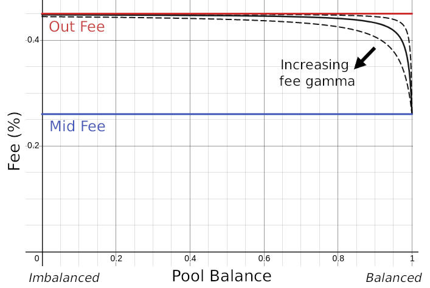

todo:
add hyperlinks


The AMM (automatic market maker) infrastructure involves the following parts:

- Factory
- AMM blueprint contract
- Liquidity Gauge blueprint contract
- Maths Contract
- Views Contract


three classes of parameters: 

- bonding curve: `A` and `gamma`  
- price scaling: `ma_time`, `allowed_extra_profit` and `adjustment_step`  
- [fee](#fee): `mid_fee`, `out_fee` and `fee_gamma` 


`packed_fee_params` contains `mid_fee`, `out_fee`, `fee_gamma`.
`packed_rebalacing_parameters` contains `allowed_extra_profit`, `adjustment_step`, and `ma_time`.

when changing parameters, new fees get _pack() again into one variable.

??? quote "_pack()"

    ```python hl_lines="1 3 8 13"
    @internal
    @view
    def _pack(x: uint256[3]) -> uint256:
        """
        @notice Packs 3 integers with values <= 10**18 into a uint256
        @param x The uint256[3] to pack
        @return uint256 Integer with packed values
        """
        return (x[0] << 128) | (x[1] << 64) | x[2]
    ```


??? quote "_unpack()"

    ```python hl_lines="1 3 8 13"
    @internal
    @view
    def _unpack(_packed: uint256) -> uint256[3]:
        """
        @notice Unpacks a uint256 into 3 integers (values must be <= 10**18)
        @param val The uint256 to unpack
        @return uint256[3] A list of length 3 with unpacked integers
        """
        return [
            (_packed >> 128) & 18446744073709551615,
            (_packed >> 64) & 18446744073709551615,
            _packed & 18446744073709551615,
        ]
    ```


## **Bonding Curve Parameters**

## Fee parameters


## **Methods**

Fees are charged based on the balance/imbalance of the pool. Fee is low when the pool is balanced and increases the more it is imbalanced.

There are three different kind of fees:  

- `fee_mid`: charged fee when pool is perfectly balanced (minimum possible fee).  
- `out_fee`: charged fee when pools is completely imbalanced (maximum possible fee).
- `fee_gamma`: determines the speed at which the fee increases when the pool becomes imbalanced. A low value leads to a more rapid fee increase, while a high value causes the fee to rise more gradually.


<figure markdown>
  { width="400" }
  <figcaption></figcaption>
</figure>