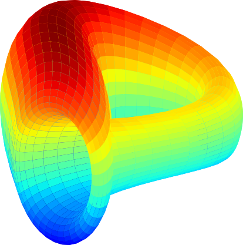

<h1>Curve Finance: Protocol Overview</h1>

Curve is a decentralized exchange and automated market maker on Ethereum, designed for the efficient trading of stablecoins and other assets. The platform is distinguished by its low-risk, supplemental fee income opportunities for liquidity providers, without an opportunity cost. Additionally, Curve has introduced its own stablecoin, crvUSD, which features a unique liquidation mechanism (LLAMMA).

This documentation outlines the technical implementation of the core Curve protocol and related smart contracts. It may be useful for contributors to the Curve codebase, third-party integrators, or technically proficient users of the protocol.

For non-technical users, the [Resources](https://resources.curve.fi/) site offers more general insights and information.

**Curve can be broadly separated into the following categories:**

-   {: style="width: 22px; height: auto; vertical-align: middle;" } __Curve DAO__

    ---

    Protocol governance and value accrual

-   {: style="width: 24px; height: auto; vertical-align: middle;" } __Curve Stablecoin (crvUSD)__

    ---

    Stablecoin using LLAMMA (Lending-Liquidating AMM Algorithm) 

-   :material-scale-balance:{ .lg .middle } __StableSwap Exchange__

    ---

    Exchange contracts for stable assets

-   :material-scale-unbalanced:{ .lg .middle } __CryptoSwap Exchange__

    ---

    Exchange contracts for volatile assets

-   :material-database-cog-outline:{ .lg .middle } __Registry__

    ---

    Standardized API and on-chain resources to aid 3rd party integrations

-   :octicons-gear-16:{ .lg .middle } __Pool Factory__

    ---

    Permissionless deployment of liquidity pools and gauges

-   >:material-link: __API__
    ---

    *soon*

-   >:material-chart-line: __Oracles__
    ---

    *soon*

!!!info "Ape Framework"
    This project relies heavily upon **`ape`** and the documentation assumes a basic familiarity with it. You may wish to view the [Ape documentation](https://docs.apeworx.io/ape/stable/index.html) if you have not used it previously.