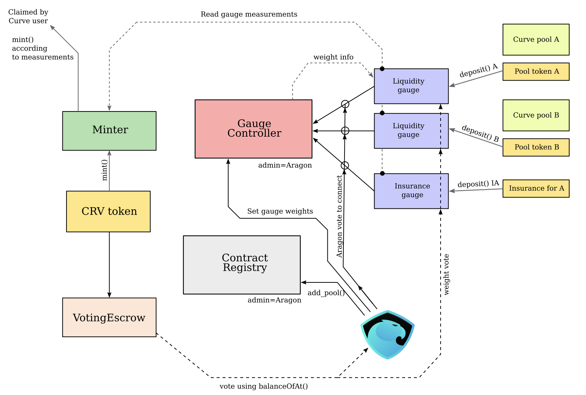
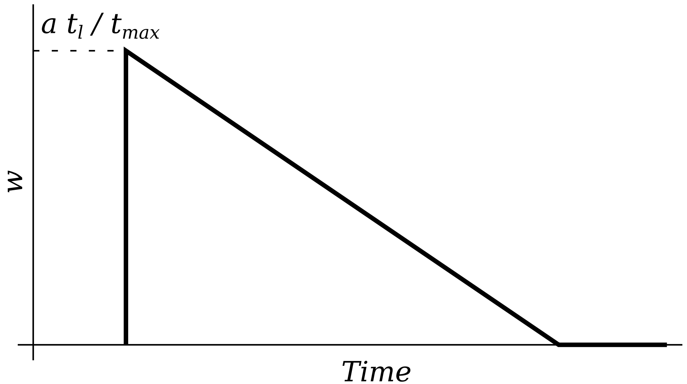
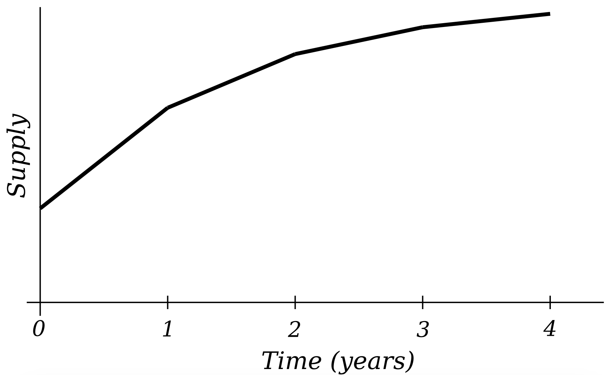

!!!example
    PDF version: [here](../../pdf/CurveDAO.pdf)

<h1 style="text-align: center;"></h1>
<h2 style="text-align: left;">Curve DAO</h2>

Curve DAO consists of multiple smart contracts connected by Aragon. Apart from that, standard Aragon’s 1 token = 1 vote method is replaced with the voting weight proportional to locktime, as will be described below.

<figure markdown>
  { width="500" }
  <figcaption>Figure 1: Curve DAO contracts managed by Aragon</figcaption>
</figure>

Curve DAO has a token CRV which is used for both governance and value accrual.

## **Time-weighted voting. Vote-locked tokens in VotingEscrow**
Instead of voting with token amount a, in Curve DAO tokens are lockable in a VotingEscrow for a selectable locktime $t_l$, where $t_l < t_{max}$ and $t_{max} = 4$ years. After locking, the time left to unlock is $t ≤ tl$. The voting weight is equal to:

$$ w = a \frac{t}{t_{max}}. $$

In other words, the vote is both amount- and time-weighted, where the time counted is how long the tokens cannot be moved in future.  
The account which locks the tokens cannot be a smart contract (because can be tradable and/or tokenized), unless it is one of whitelisted smart contracts (for example, widely used multi-signature wallets).

VotingEscrow tries to resemble Aragon’s Minime token. Most importantly, `balanceOf()` / `balanceOfAt()` and `totalSupply()` / `totalSupplyAt()` return the time-weighted voting weight $w$ and the sum of all of those weights $W = \sum w_i$ respectively. Aragon can interface VotingEscrow as if it was a typical governance token.

<figure markdown>
  { width="500" }
  <figcaption>Figure 2: Voting weight of vote-locked tokens</figcaption>
</figure>

Locks can be created with `create_lock()`, extended in time with `increase_unlock_time()` or token amount with `increase_amount()` and `withdraw()` can remove tokens from the escrow when the lock is expired.    

### **Implemention Details**
User voting power $w_i$ is linearly decreasing since the moment of lock. So does the total voting power $W$. In order to avoid periodic check-ins, every time the user deposits, or withdraws, or changes the locktime, we *record user’s slope and bias* for the linear function $w_i(t)$ in **user_point_history**. We also change slope and bias for the total voting power $W(t)$ and record in **point_history**. In addition, when user’s lock is scheduled to end, we *schedule* change of slopes of $W(t)$ in the future in **slope_changes**. Every change involves increasing the **epoch** by 1.  
This way we don’t have to iterate over all users to figure out, how much should $W(t)$ change by, neither we require users to check in periodically. However, we limit the end of user locks to times rounded off by whole weeks.  
Slopes and biases change both when a user deposits and locks governance tokens, and when the locktime expires. All the possible expiration times are rounded to whole weeks to make number of reads from blockchain proportional to number of missed weeks at most, not number of users (which can be potentially large).

## **Inflation schedule. ERC20CRV**
Token *ERC20CRV* is an ERC20 token which allows a piecewise linear inflation schedule. The inflation is dropping by $2^{1/4}$ every year. Only *Minter* contract can directly mint *ERC20CRV*, but only within the limits defined by inflation.
Each time the inflation changes, a new mining epoch starts

<figure markdown>
  { width="500" }
  <figcaption>Figure 3: CRV token inflation schedule</figcaption>
</figure>

Initial supply of CRV is 1.273 billion tokens, which is 42% of the eventual $(t → ∞)$ supply of ≈ 3.03 billion tokens. All of those initial tokens tokens are gradually vested (with every block). The initial inflation rate which supports the above inflation schedule is r = 22.0% (279.6 millions per year). All of the inflation is distributed to users of Curve, according to measurements taken by *gauges*. During the first year, the approximate inflow into circulating supply is 2 millions CRV per day, starting from 0.

## **System of Gauges. LiquidityGauge and GaugeController**
In Curve, inflation is going towards users who use it. The usage is measured with Gauges. Currently there is just *LiquidityGauge* which measures, how much liquidity does the user provide. The same type of gauge can be used to measure “liquidity” provided for insurance.

For *LiquidityGauge* to measure user liquidity over time, the user deposits his LP tokens into the gauge using `deposit()` and can withdraw using `withdraw()`.

Coin rates which the gauge is getting depends on current inflation rate, and gauge type weights (which get voted on in Aragon). Each user gets inflation proportional to his LP tokens locked. Additionally, the rewards could be *boosted* by up to factor of 2.5 if user vote-locks tokens for Curve governance in *VotingEscrow*.

The user does not require to periodically check in. We describe how this is achieved in technical details.

*GaugeController* keeps a list of Gauges and their types, with weights of each
gauge and type.

Gauges are per pool (each pool has an individual gauge).

### **LiquidityGauge implemention details**
Suppose we have the inflation rate $r$ changing with every epoch (1 year), gauge weight $w_g$ and gauge type weight $w_t$. Then, all the gauge handles the stream of inflation with the rate $r' = w_g w_t r$ which it can update every time $w_g$, $w_t$, or mining epoch changes.  
In order to calculate user’s fair share of $r'$ , we essentially need to calculate the integral:

$$ I_u = \int \frac{r'(t) b_u(t)}{S(t)}dt, $$

where $b_u(t)$ is the balance supplied by user (measured in LP tokens) and $S(t)$ is total liquidity supplied by users, depending on the time $t$; the value $I_u$ gives the amount of tokens which user has to have minted to him. The user’s balance $b_u$ changes every time user *u* makes a deposit or withdrawal, and $S$ changes every time *any* user makes a deposit or withdrawal (so S can change many times in between two events for the user *u*). In *LiquidityGauge* contract, the vaule of $I_u$ is recorded in the **integrate_fraction map, per-user**.

In order to avoid all users to checkpoint periodically, we keep recording values of the following integral (named **integrate_inv_supply** in the contract):

$$ I_{is}(t) = \int^t_0 \frac{r'(t)}{S(t)}dt. $$

The value of $I_{is}$ is recorded at any point any user deposits or withdraws, as well as every time the rate $r'$ changes (either due to weight change or change of mining epoch).

When a user deposits or withdraws, the change in $I_u$ can be calculated as the current (before user’s action) value of $I_{is}$ multiplied by the pre-action user’s balance, and sumed up across user’s balances:

$$ I_u(t_k) = \sum_k b_u(t_k) [I_{is}(t_k) - I_{is}(t_{k-1})]. $$

The per-user integral is possible to repalce with this sum because $b_u(t)$ is unchanged for all times between $t_{k−1}$ and $t_k$.

In order to incentivize users to participate in governance, and additionally create stickiness for liquidity, we implement the following mechanism. User’s balance counted in the *LiquidityGauge* gets boosted by users locking CRV tokens in *VotingEscrow*, depending on their vote weight $w_i$:

$$ b^*_u = min(0.4b_u + 0.6S \frac{w_i}{W}, b_u). $$

The value of $w_i$ is taken at the time user performs any action (deposit, withdrawal, withdrawal of minted CRV tokens) and is applied until the next action this user performs.

If no users vote-lock any CRV (or simply don’t have any), the inflation will simply be distributed proportionally to the liquidity $b_u$ each one of them provided. However, if a user stakes much enough CRV, he is able to boost his stream of CRV by up to factor of 2.5 (reducing it slightly for all users who are not doing that).

Implementation details are such that a user gets the boost actual at the time of the last action or checkpoint. Since the voting power decreases with time, it is favorable for users to apply a boost and do no further actions until they vote-lock more tokens. However, once vote-lock expires, everyone can “kick” the user by creating a checkpoint for that user and, essentially, resetting the user to no boost if he/she has no voting power at that point already.

Finally, the gauge is supposed to not miss a full year of inflation (e.g. if there were no interactions with the guage for the full year). If that ever happens, the abandoned gauge gets less CRV.

## **Weight voting for gauges**
Instead of simply voting for weight change in Aragon, users can allocate their vote-locked tokens towards one or other Gauge (pool). That pool will be getting a fraction of CRV tokens minted proportional to how much vote-locked tokens are allocated to it. Eeach user with tokens in VotingEscrow can change his/her preference at any time.

When a user applies a new weight vote, it gets applied only in the beginning of the next whole week (this is done for scalability reasons). The weight vote for the same gauge can be changed not more often than once in 10 days.

### **GaugeController implementation details**
In order to implement weight voting, *GaugeController* has to include parameters handling linear character of voting power each user has.

Similarly to how it is done in VotingEscrow, GaugeController records points (bias+slope) per gauge in **vote_points**, *scheduled* changes in biases and slopes for those points in **vote_bias_changes** and **vote_slope_changes**, with those changes happening every round week, as well as current slopes for every user per-gauge in **vote_user_slopes**, along with the power the user has used and the time their vote-lock ends. The totals for slopes and biases for vote weight per gauge, and sums of those per type, get scheduled / recorded for the next week, as well as the points when voting power gets to 0 at lock expiration for some of users.

When user changes his preferences, the change of the gauge weight is scheduled for the next round week, not immediately. This is done in order to reduce the number of blockchain reads which need to be performed by each user: that will be proportional to the number of weeks since the last change instead of the number of interactions other users did.

*GaugeController* is one of the most central pieces to the system, so it must be controlled by the DAO. No centralized admin should control it, to not give anyone powers to change type weights unilaterally.

## **Fee Burner**
Every pool allows the admin to collect fees using **withdraw_admin_fees**. Aragon should be able to collect those fees to the admin account and use them to buy and burn **CRV** on a free market once that free market exists. That should be possible to be done by anyone without a vote. 

Instead of burning, there could be different mechanisms working with the same interface. In any case, this will not be immediately applied.

## **Gauges to reward trading volume and governance votes**
Both votes and trades are discrete events, so they can use the same sort of gauge. The idea is that each event has a weight which exponentially decays over time.

It should be possible to call a gauge contract every time a user votes in Aragon.

